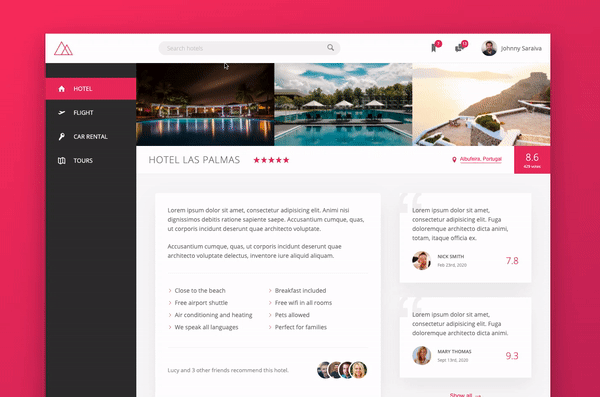

<p align="center">
    
</p>

<h1 align="center">
   🏨 Trillo 🛫
</h1>

<p align="center">


</p> 

<p align="center">
  <a href="#computer-about-the-project">About the Project</a>&nbsp;&nbsp;&nbsp;|&nbsp;&nbsp;&nbsp;
  <a href="#hammer-technologies">Technologies</a>&nbsp;&nbsp;&nbsp;|&nbsp;&nbsp;&nbsp;
  <a href="#rocket-getting-started">Getting Started</a>&nbsp;&nbsp;&nbsp;|&nbsp;&nbsp;&nbsp;
  <a href="#mailbox-contacts">Contacts</a>&nbsp;&nbsp;&nbsp;|&nbsp;&nbsp;&nbsp;  
  <a href="#memo-license">License</a>&nbsp;&nbsp;&nbsp;
</p>

<br>

<p align="center">
  
</p>

<br>

## :computer: About the Project 

Trillo is a tutorial project made on [Advanced CSS and Sass](https://www.udemy.com/course/advanced-css-and-sass/) course by Udemy to learn more about CSS. 🧑🏻‍💻

## :hammer: Technologies

This project was built with:


-  [HTML](https://developer.mozilla.org/pt-BR/docs/Web/HTML/HTML5)
-  [CSS](https://developer.mozilla.org/pt-BR/docs/Web/CSS)
-  [SASS](https://sass-lang.com/documentation)


## :rocket: Getting Started

**Clone or Download the Repository**

```bash
$ git clone https://github.com/Johnny-Saraiva/trillo.git

$ cd trillo
```

**Installing Dependencies**

```bash
# if you use yarn, run this:

$ yarn
```
or
```bash
# if you use npm, run this:

$ npm install
```

### Run the project

```bash
# if you use yarn, run this:

$ yarn start

# if you use npm, run this:

$ npm run start

```

## :mailbox: Contacts

Connect with me on [LinkedIn](https://www.linkedin.com/in/johnny-saraiva-701641164/).

## :memo: License

This project is under the MIT license. See the [LICENSE](LICENSE.md) for more information..

---

Made with ❤️ by Johnny Saraiva 👋 [Get in touch!](https://www.linkedin.com/in/johnny-saraiva-701641164/)